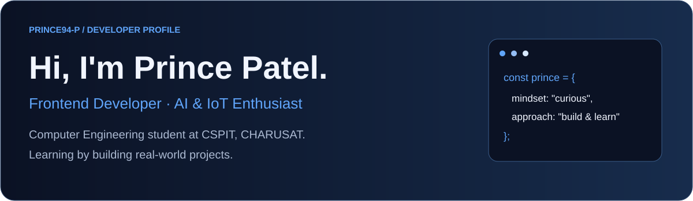
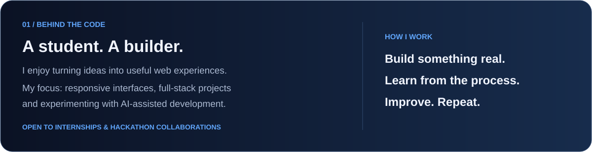
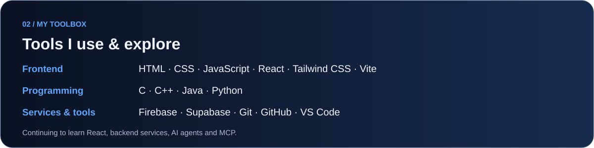
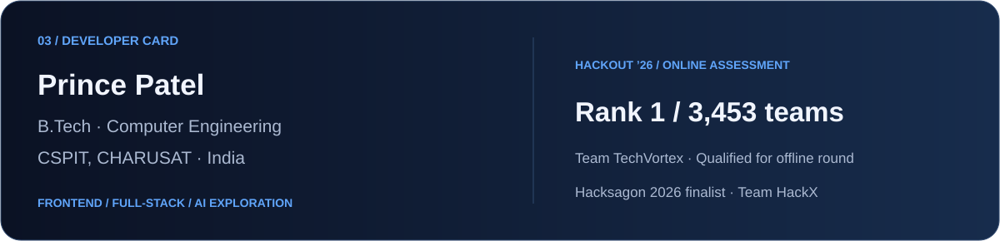
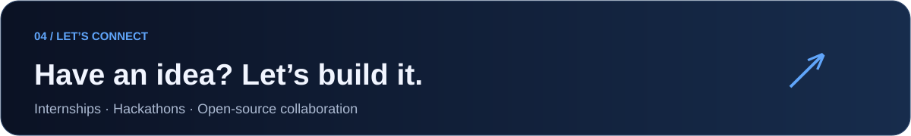

  

<a href="https://prince94-p.github.io/portfolio1/">Portfolio</a> ·
<a href="https://www.linkedin.com/in/prince-patel-a9b579372">LinkedIn</a> ·
<a href="mailto:princepatel98798@gmail.com">Email</a>

  

  

 

  

## Featured builds

| Project | What I built | Technologies |
|:---|:---|:---|
| [**Carbon Core**](https://github.com/Prince94-p/Hackout) | Industrial carbon intelligence: emission hotspots and circular alternatives. Built at HackOut ’26. | JavaScript · FastAPI · SQLAlchemy |
| [**ANVAY**](https://github.com/Prince94-p/ANVAY) | Healthcare interoperability platform with patient records, role-based access and emergency access. | React · Firebase · Express |
| [**ScamShield**](https://github.com/Prince94-p/Hacksagone2k26) | Scam detection platform built with Team HackX at Hacksagon 2026. | React · Node.js · Express |
| [**Trip & Travel Hub**](https://github.com/Prince94-p/ODOO-X-PARUL) | Itinerary planning, budgeting and travel management for the Odoo × Parul hackathon. | React · JavaScript · Vite |
| [**CodeMentor**](https://github.com/Prince94-p/codementor) | Coding-practice frontend with problem listings and a responsive workspace. | React · JavaScript · CSS |

## Milestones

- **HackOut ’26:** Rank 1 among 3,453 teams in the Online Assessment; qualified for the offline hackathon at DAIICT with Team TechVortex.
- **Hacksagon 2026:** National hackathon finalist at ABV-IIITM Gwalior with Team HackX.
- **ICT Project Exhibition:** 1st runner-up at CSPIT, CHARUSAT.

## Certifications

- [IBM AI Developer Professional Certificate](https://coursera.org/verify/professional-cert/2GWBMS2N58YK)
- [Object Oriented Programming Specialization — Goldsmiths, University of London](https://coursera.org/verify/specialization/BNYAPRA0V693)

## My contribution city

Every contribution adds to the picture.

<!-- Generated by .github/workflows/profile-3d.yml. Run the workflow once after uploading. -->

  

 

  

**Always learning. Always building.**

